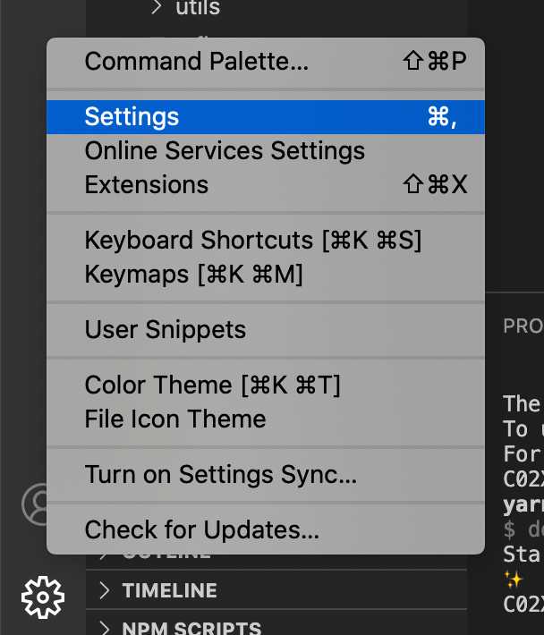
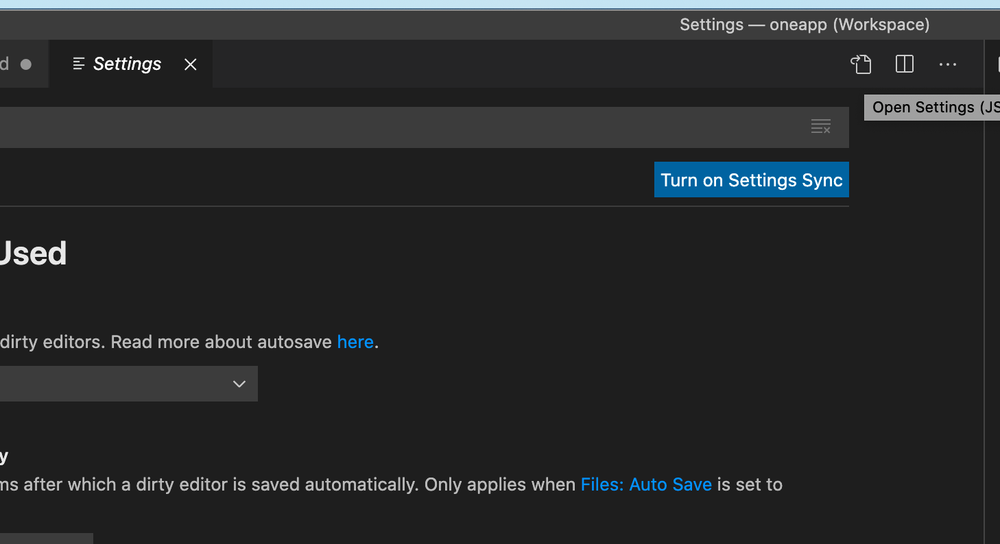

# Setup a Windows Environment for Development

- [oneapp-server and oneapp-web](#oneapp-server-and-oneapp-web)
  - [Install the Following Software](#install-the-following-software)
  - [Clone the Repository](#clone-the-repository)
  - [Open the Project in VSCode](#open-the-project-in-vscode)
  - [Setup oneapp-server & oneapp-web](#setup-oneapp-server--oneapp-web)
- [oneapp-database](#oneapp-database)
  - [Docker Install (Optional, not possible using remote desktop / VM / Citrix)](#docker-install-optional-not-possible-using-remote-desktop--vm--citrix)
  - [Configuring the Database](#configuring-the-database)
- [Putting It All Together](#putting-it-all-together)
- [Troubleshooting](#troubleshooting)
  - [VisualStudio Code Terminal on Windows](#visualstudio-code-terminal-on-windows)

## oneapp-server and oneapp-web

### Install the Following Software

Installers for the software can be found in https://github.com/newjersey/dhs-oneapp-software if you are unable to access the internet on your development machine.

* Git
  * Git for Windows
  * GitHub Desktop
  * GitLFS
* Node
  * Make sure when running the installer, you specify to install optional dependencies.
* Yarn
  * Node must be installed first
* VSCode

Restart. Node and Yarn install PATH dependencies that will not be available until after a restart.

### Clone the Repository

1. Open GitHub Desktop and clone the `newjersey/dhs-oneapp` repository.
   1. This will prompt you to login to your GitHub account
2. When GitHub Desktop asks you about initializing GitLFS, you should proceed with initializing GitLFS
3. If you run into any issues with cloning the repository, there are a few steps to try:
   1. Retrying the clone several times will sometimes work. The NJ firewall occasionally causes redirection issues.
   2. Reboot.
   3. Disable Git SSL verification with the following command: `git config --global http.sslVerify false`

### Open the Project in VSCode

1. Open VSCode
2. Under the Start section, select Open Folder
3. Open the folder where GitHub stored the cloned repository (should be `Documents/GitHub/dhs-oneapp`)
4. Open a Terminal prompt (Terminal > New Terminal)
5. If you have a internet proxy, run the following commands (replace with your real proxy information):
   1. `yarn config set "strict-ssl" false`
   2. `yarn config set proxy http://0.0.0.0:8080`
   3. `yarn config set https-proxy http://0.0.0.0:8080`

### Setup oneapp-server & oneapp-web

Follow these directions if you have admin rights and are not going through a restrictive internet proxy.

1. In the terminal prompt, run `yarn install`
2. Wait for all of the modules to download and install
3. Start the server in development mode: `yarn serve`
4. Verify the server starts up without error (there will be more to do to get it functioning, but it should start at this step)

## oneapp-database

### Docker Install (Optional, not possible using remote desktop / VM / Citrix)

If you have admin access on your machine, and have the ability to install Docker, running the database in Docker will make development easier.

1. Follow the directions in the newjersey/dhs-oneapp-database repository to install Docker.
2. Start a local version of the database with `yarn start`

### Configuring the Database


In the `oneapp-server` directory, create a `.env` file. The file should look like:

```
DB_HOST=
DB_USER=
DB_PASS=
DB_SID=
DB_PORT=
```

Replace each of the values with the connection information for your database. Reach out to a OneApp developer to obtain this information if you're not running the database locally in Docker.

## Putting It All Together

With all the above steps completed, you should now be able to fully start up the server. Run the following command from the root directory to start the server (with live reloading support):

`yarn serve`

## Troubleshooting

### VisualStudio Code Terminal on Windows

If you're having trouble running yarn on the terminal within VisualStudio Code, make sure you're using Git Bash as your default terminal. You can customize which terminal is used as your default terminal by editing your user's setting.json file. To do so:

1. Click the settings cog on the bottom left of the window. Select the Settings option.


2. On the settings page that loads, select the user tab.


3. On the top right, click the button labeled "Open Settings (JSON)".


4. On the new tab that opens up, edit your settings to add this setting option:
```
{
    "terminal.integrated.shell.windows": "C:\\Program Files\\Git\\bin\\bash.exe",
}
```
Note: Change the path to point to the actual location of where Git Bash is installed on your machine.